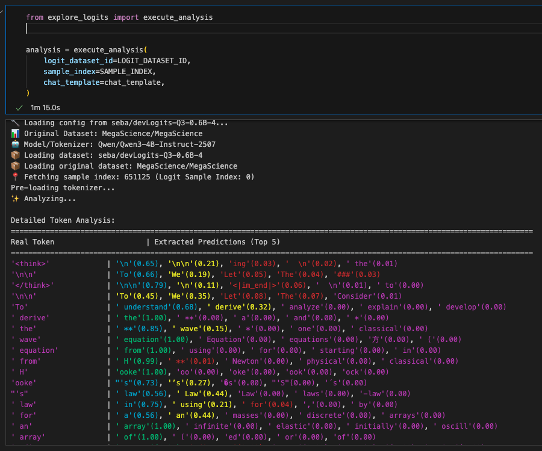

# Logit Extraction for Knowledge Distillation

This repository provides tools for extracting token-level logits (probabilities) from Large Language Models in a highly compressed format, designed for efficient knowledge distillation.

## Overview

The pipeline consists of three main components:

| Script | Purpose |
|--------|---------|
| `compute_lengths.py` | Pre-compute token lengths for efficient batch ordering |
| `extract_logits.py` | Extract and compress logits from model inference |
| `explore_logits.py` | Load, decompress, and analyze extracted logits |

### Why Compressed Logits?

Full logit extraction stores the entire vocabulary distribution per token (~150K floats × 4 bytes = 600KB per token). This repository instead extracts:

1. **Nucleus (Top-P) Logits**: The minimum set of tokens whose cumulative probability exceeds a threshold (e.g., 98%), up to a maximum count (e.g., 100 tokens)
2. **Sampled Logits**: Additional randomly sampled tokens from the remaining vocabulary (e.g., 24 tokens)

This reduces storage by ~1000x while preserving the information needed for distillation.

## Supported Use Cases

- **Models**: Instruction-tuned models with chat templates (e.g., Qwen-Instruct, Llama-Chat). Base models without chat templates are not supported.
- **Datasets**: Single-turn conversations (User → Assistant). Multi-turn is not currently supported.

---

## Quick Start

### 1. Pre-compute Token Lengths (Optional but Recommended)

Pre-computing lengths enables **length-based batch ordering**, which dramatically improves GPU utilization. The extraction script sorts examples by length (longest first) and dynamically increases batch size as sequence length decreases. This prevents wasted padding and maximizes throughput.

```bash
python compute_lengths.py \
    --model Qwen/Qwen3-4B-Instruct-2507 \
    --dataset MegaScience/MegaScience \
    --output-repo your-username/MegaScience-Lengths-Qwen3 \
    --chat-template ./qwen_chat_template.jinja \
    --user-col question \
    --assistant-col answer \
    --num-proc 16 \
    --push-to-hub
```

**Key Arguments:**
| Argument | Description |
|----------|-------------|
| `--model` | HuggingFace model ID (tokenizer must match the extraction model) |
| `--dataset` | Source dataset to compute lengths for |
| `--output-repo` | HuggingFace repo to upload the lengths dataset |
| `--chat-template` | Path to custom Jinja2 chat template (required if model template lacks `assistant_mask`) |
| `--num-proc` | Number of parallel workers for tokenization |
| `--push-to-hub` | Upload result to HuggingFace Hub |

### 2. Extract Logits

This is the main extraction script. Here's a complete example with explanations:

```bash
python extract_logits.py \
    --model Qwen/Qwen3-4B-Instruct-2507 \
    --dataset MegaScience/MegaScience \
    --output seba/MegaScience-Q3-4B-I-2507-Logits \
    --max-seq-len 4096 \
    --upload-every 15000 \
    --subject-col subject \
    --tokenized-dataset seba/MegaScience-Lengths-Qwen3 \
    --chat-template ./qwen_chat_template.jinja \
    --sample-subject '{"*": 50000}' \
    --length-col length \
    --resume \
    --random-sample
```

**Argument Breakdown:**

| Argument | Value | Explanation |
|----------|-------|-------------|
| `--model` | `Qwen/Qwen3-4B-Instruct-2507` | The model to extract logits from |
| `--dataset` | `MegaScience/MegaScience` | Source dataset with conversations |
| `--output` | `seba/MegaScience-Q3-4B-I-2507-Logits` | HuggingFace repo for extracted logits |
| `--max-seq-len` | `4096` | Skip examples longer than this (prevents OOM) |
| `--upload-every` | `15000` | Upload a parquet chunk every N samples |
| `--subject-col` | `subject` | Column for stratified sampling (optional) |
| `--tokenized-dataset` | `seba/MegaScience-Lengths-Qwen3` | Pre-computed lengths dataset (from step 1) |
| `--chat-template` | `./qwen_chat_template.jinja` | Custom chat template with `` markers |
| `--sample-subject` | `'{"*": 50000}'` | Sample up to 50k examples per subject (`*` = default) |
| `--length-col` | `length` | Column name containing token lengths |
| `--resume` | flag | Resume from previous checkpoint if interrupted |
| `--random-sample` | flag | Randomly sample instead of taking first N |

**Additional Useful Arguments:**

| Argument | Default | Description |
|----------|---------|-------------|
| `--top-p` | `0.98` | Nucleus sampling threshold (cumulative probability) |
| `--top-p-max` | `100` | Maximum tokens in nucleus |
| `--sampled-n` | `24` | Additional tokens sampled from remaining vocab |
| `--batch-thresholds` | auto | JSON dict mapping seq_len → batch_size |
| `--limit` | None | Limit total samples to process |
| `--full-dataset` | flag | Process entire dataset (no sampling) |

### 3. Analyze Extracted Logits

Use `explore_logits.py` or the Jupyter notebook to verify extractions and analyze model confidence:

```python
from explore_logits import execute_analysis

# Run full alignment analysis for a sample
analysis = execute_analysis(
    logit_dataset_id="seba/MegaScience-Q3-4B-I-2507-Logits",
    sample_index=0,
    chat_template="./qwen_chat_template.jinja"  # Same template used for extraction
)
```

Or explore interactively:

```python
from explore_logits import (
    load_logit_dataset,
    get_sample,
    print_sample_info,
    dequantize_top_logits,
    plot_nucleus_sizes
)

# Load and inspect
ds = load_logit_dataset("seba/MegaScience-Q3-4B-I-2507-Logits")
sample = get_sample(ds, index=0)
print_sample_info(sample)

# Visualize nucleus size distribution
plot_nucleus_sizes(sample)

# Get logits for a specific token position
indices, logits = dequantize_top_logits(sample, token_idx=0)
```

---

## Data Format

The extracted data is stored as Parquet files with the following schema:

| Column | Type | Description |
|--------|------|-------------|
| `index` | int32 | Original dataset index |
| `num_tokens` | int32 | Number of extracted tokens |
| `top_indices_low` | list[uint16] | Lower 16 bits of nucleus token IDs |
| `top_indices_high` | binary | Upper 2 bits packed (4 per byte) |
| `top_logits_quantized` | list[uint16] | Quantized nucleus logits |
| `top_counts` | list[uint8] | Number of nucleus tokens per position |
| `top_min` / `top_max` | list[float32] | Quantization range per position |
| `sampled_indices_*` | same as top | Sampled token data (same format) |
| `logsumexp` | list[float32] | LogSumExp for probability reconstruction |

### Index Packing

Token IDs are split to save space (most tokens fit in 16 bits, but vocabularies >65536 need more):

```python
full_index = low_bits | (high_bits << 16)
```

The `high_bits` are packed 4 per byte:
- Bits 0-1: Index 0
- Bits 2-3: Index 1
- Bits 4-5: Index 2
- Bits 6-7: Index 3

### Logit Dequantization

Logits are quantized to uint16 for storage. To reconstruct:

```python
logit = (quantized / 65535) * (max - min) + min
probability = exp(logit - logsumexp)
```

---

## Chat Templates & Assistant Masks

**CRITICAL**: The extraction relies on the tokenizer's chat template producing an `assistant_mask` to identify which tokens belong to the model's response. Many default templates **DO NOT** produce this mask.

If you get 0 tokens extracted, you need a custom template with `` markers:

```jinja


<|im_start|>user
{{ message['content'] }}<|im_end|>

<|im_start|>assistant
{{ message['content'] }}<|im_end|>


```

The `` / `` markers define the assistant response region.

---

## Analysis Visualization

Shows the prediction probabilities for the next token.



## Efficient Batching with Pre-computed Lengths

When you provide pre-computed token lengths via `--tokenized-dataset` and `--length-col`:

1. **Sorting**: Examples are sorted by length in **descending order** (longest first)
2. **Dynamic Batching**: Batch size increases as sequence length decreases based on thresholds:
   ```
   Length ≤ 256  → batch size 16
   Length ≤ 512  → batch size 8
   Length ≤ 1024 → batch size 4
   Length ≤ 2048 → batch size 2
   Length > 2048 → batch size 1
   ```
3. **Benefits**:
   - Minimizes padding waste (similar-length sequences grouped together)
   - Maximizes GPU utilization (larger batches for shorter sequences)
   - Prevents OOM (long sequences processed individually)

Without pre-computed lengths, the script processes examples in dataset order with conservative batch sizes.

---

## Resume Support

The extraction supports graceful interruption and resume:

- Press `Ctrl+C` once to trigger graceful shutdown (flushes current buffer)
- Use `--resume` to continue from the last checkpoint
- Checkpoints are stored locally (`.logit_extraction_cache/`) and on HuggingFace

---

## Installation

### Using uv (Recommended)

[uv](https://github.com/astral-sh/uv) is a fast Python package manager. Install dependencies with:

```bash
# Install core dependencies
uv sync

# Include visualization tools (matplotlib, seaborn, termcolor)
uv sync --extra viz

# Include everything (viz + Jupyter)
uv sync --extra all
```

Run scripts directly with uv:

```bash
uv run python extract_logits.py --model ... --dataset ... --output ...
uv run python compute_lengths.py --model ... --dataset ...
```

### Using pip

```bash
# Install core dependencies
pip install -e .

# Include visualization tools
pip install -e ".[viz]"

# Include everything
pip install -e ".[all]"
```

### Dependencies

**Core** (required for extraction):
- `torch` - GPU computation
- `transformers` - Model loading, tokenization
- `datasets` - HuggingFace dataset loading
- `huggingface-hub` - Upload to Hub
- `pandas`, `pyarrow` - Parquet I/O
- `numpy`, `tqdm` - Utilities

**Visualization** (`[viz]` extra):
- `matplotlib`, `seaborn` - Plotting
- `termcolor` - Colored console output

**Development** (`[dev]` extra):
- `jupyter`, `ipykernel` - Notebook support
